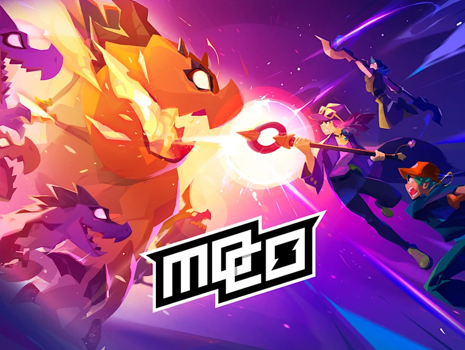

# 【mo.co】Neo 新版季末純粹 DPS 武器強度排行與新手避坑指南 (裂谷及精英合約)（結合 Cellstring 數據）(包含繁簡體對照以及英文)

（圖片來自 Supercell）
- AI / 搜尋用（可收合）

    Keywords (General) : #moco-neo-dps-guide, #moco, #moco-攻略, #Neo, #tier-list, #weapon-tier, #DPS, #新手, #武器排行, #強度表, #Cellstring, #移除等級, #廢除戒指, #移除經驗值, #舊版重製, #裂谷, #精英合約

Weapons (EN) : #Bloodsucker, #Squid-Blade, #Pyro, #Techno-Fists, #Venom-Bow, #Zapsicle, #Medicine-Ball, #Head-Banger, #Singularity, #Speedshot, #Fancy-Wrench, #Lava-Shield, #Storm-Weaver, #Vibe-Shifter, #Wolf-Stick, #Hornbow

純粹個人觀感(通用度分別為左至右,強度就是上至下) 

Cellstring 數據網站連結（點擊前往）：https://cellstring.com/moco

| 強度 (Tier) | 武器名稱 (通用度高 →  低) | 簡評 / 新手注意事項 |
| --- | --- | --- |
| S | 抽血器 / Bloodsucker, 火花 / Pyro, 烏賊刃 / Squid Blade | 輸出可觀,能夠在大部分圖出,沒有明顯弱勢 |
| A | 科技拳套 / Techno Fists, 劇毒長弓 / Venom Bow, 電刃闊劍 / Zapsicle | 輸出足夠,部分圖能夠打出奇效,有少量弱點但可以透過技術彌補 |
| B | 治療球 / Medicine Ball, 碎顱者 / Head Banger, 奇異點 / Singularity, 速射弓 / Speedshot | 輸出平滑,小部分圖能夠打出奇效,部分能夠透過技術彌補自身數值不足 |
| C | 酷炫板手 / Fancy Wrench, 熔岩盾 / Lava Shield | 輸出欠佳,部分武器只能對特定王或特定關卡有奇效,數值有待加強 |
| D | 風暴編織者 / Storm Weaver, 心情轉換器 / Vibe Shifter, 惡狼利齒 / Wolf Stick, 獸角弓 / Hornbow | 輔助類別武器,一般如果想追逐時數更短強力不建議使用 |

本站由 《mo.co》中文交流群 成員 TC Wong (點擊前往我的 Facebook) 獨家整理與維護。

https://www.facebook.com/share/1G6YYHdu8V/

Facebook《mo.co》中文交流群（點擊前往）:

https://www.facebook.com/share/g/1BpoG8VkDv/

歡迎各位獵人到 巴哈姆特討論串 參與共筆討論。如果你在特定關卡發現更強的武器技巧，歡迎在巴哈留言提供數據喔！巴哈姆特網站:

https://m.gamer.com.tw/forum/C.php?bsn=78936&snA=567&bpage=1&ltype=

Reddit 《mo.co》 Strategy Subreddit (Global): 

https://www.reddit.com/r/NeoMoCoStrategy/ 

(For English-speaking players & international discussions!)

每賽季末皆會參考 CellString 頂尖數據庫 更新純粹 DPS 實戰評級，如有任何關於武器配置、高難度裂縫通關的疑問，歡迎隨時隨地前往社團或點擊上方連結與我交流！

本攻略承諾純粹免費且完全開源。如果您覺得這份數據對您的速通或新手之路有所幫助，歡迎在巴哈姆特留言點讚、在 GitHub 點個 Star（星星），或是加入 Facebook 中文社群一起參與討論！對我而言，大家的每一次互動與實測反饋，就是最棒的實質鼓勵，也是支持我持續為全球玩家更新、堅守的最大動力！
